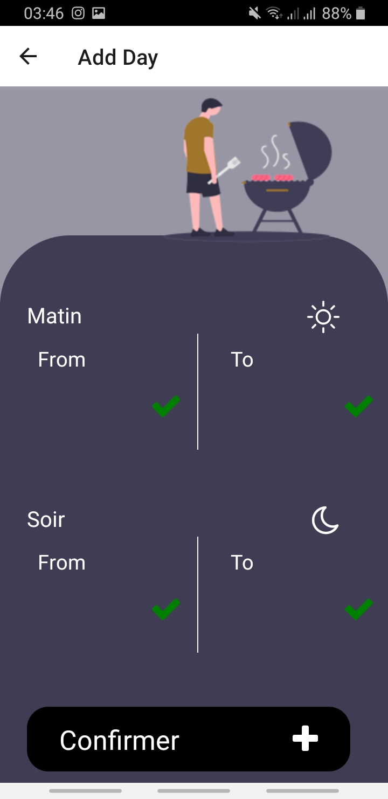
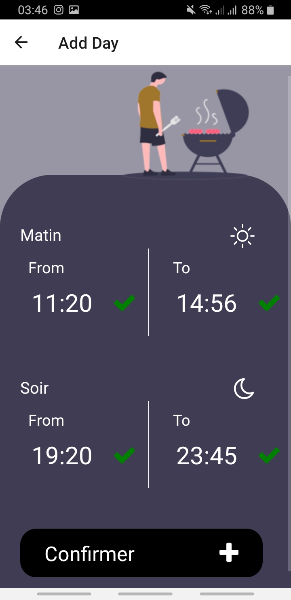

# Work-App
## Présentation
C'est une application qui enregistre les horaires travaillés et calcul le total des heures par semaines et combien l'employé doit étre payé, j'ai créé cette application car j'en avais besoin, en fin de chaque mois mon employeur demandé le total des heures et c'est dur de calculer à partir des notes personnelles et donc j'ai créé cette application qui fait le boulot pour moi, j'ai appris **React Native** spécialement pour ça car je voulais la partager à mes collegues qui eux sont sur **ios** et moi sur **android**.

Les commandes à exécuter:
```sh
% npm install
% react-native start
% react-native run-android
```
images de l'application
| écran de chargement avec logo du restaurant |  écran d'acceuil |
|--|--|
|  |   |
| écran d'acceuil avec données | écran mise à jour de semaine vide |
| |    |
| écran mise à jour d'une journée vide | écran mise à jour d'une journée |
|  |
 |


### Remarques
* Premier projet en **React Native**.
* Projet n'est pas encore fini, il manque des fonctionalitées a rajouter et des bugs a régler.
 
## Notes personnelles:
* Faut mettre à jour les icones pour ios.

## Libraries à supprimer:
* Rien pour le moment.

## Fonctionalités a rajouter:
* Filtre pour les semaines.
* Un menu pour les repas pris et leurs prix aprés remise.
* Un total chaque 4 semaines.
* Le menu des repas doit étre entirement customisable.
* Le montant payé par heure doit étre modifiable.

## Bugs aprés test de l'apk:
* Linear gradient de la page d'acceuile a revoir
* Calcul mal les horaires à partir de la semaine 10
* Les mois dans le slide en haut de la home page sont (m-1) janvier = 0, fevrier = 1 ....
